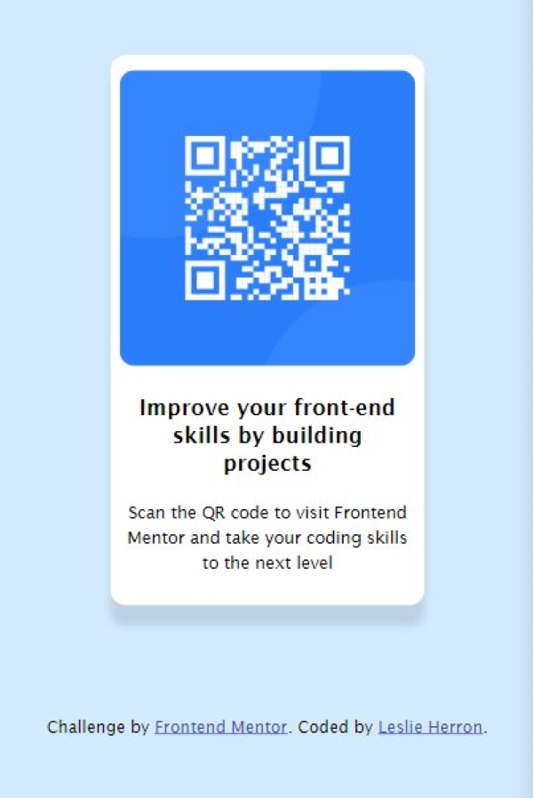

# Frontend Mentor - QR code component solution

This is a solution to the [QR code component challenge on Frontend Mentor](https://www.frontendmentor.io/challenges/qr-code-component-iux_sIO_H). Frontend Mentor challenges help you improve your coding skills by building realistic projects. 

## Table of contents

- [Overview](#overview)
  - [Screenshot](#screenshot)
  - [Links](#links)
- [My process](#my-process)
  - [Built with](#built-with)
- [Author](#author)
- [Acknowledgments](#acknowledgments)

## Overview

### Screenshot

### Links

- Solution URL: https://github.com/lesherron/qr-code-component
- Live Site URL: [My GitHub Page](https://lesherron.github.io/school-projects/)

## My process

### Built with

- HTML5
- CSS custom properties
- Flexbox
- CSS Grid
- Mobile-first workflow

## Author

- Website - [Leslie Herron](https://lesherron.github.io/school-projects/)
- Frontend Mentor - [@lesherron](https://www.frontendmentor.io/profile/lesherron)

## Acknowledgments

Thanks to Udacity's Front End Developer nanodegree program for giving me the courage to try what I'm learning in real world projects

